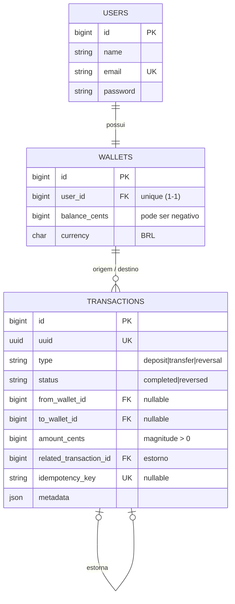

# Carteira Financeira

Aplicação de **carteira financeira** onde usuários se cadastram, autenticam e realizam
**depósitos**, **transferências** entre si e **estornos** de qualquer operação. Construída como
um **monólito Laravel + Livewire**, com foco em segurança, integridade financeira e código limpo.

> Desafio técnico full stack — Grupo Adriano Cobuccio.

---

## Sumário

- [Stack e justificativa](#stack-e-justificativa)
- [Requisitos atendidos](#requisitos-atendidos)
- [Como rodar (Docker)](#como-rodar-docker)
- [Como rodar os testes](#como-rodar-os-testes)
- [Arquitetura e decisões](#arquitetura-e-decisões)
- [Modelagem de dados](#modelagem-de-dados)
- [Segurança](#segurança)
- [Observabilidade](#observabilidade)
- [Estrutura de pastas](#estrutura-de-pastas)
- [Com mais tempo](#com-mais-tempo)

---

## Stack e justificativa

| Camada | Tecnologia |
|---|---|
| Backend / Domínio | **Laravel 13** (PHP 8.3) |
| UI | **Livewire 4** + Blade + **Tailwind v4** |
| Banco | **MySQL 8** |
| Cache | **Redis** |
| Testes | **Pest 4** (SQLite in-memory) |
| Infra | **Docker** (nginx, php-fpm, mysql, redis, node) |

**Por que Laravel?** É o stack desejado pela vaga e entrega, de forma nativa e madura, tudo que o
domínio exige: transações de banco com lock, Eloquent para modelagem, migrations, autenticação,
fila, e um ecossistema de testes de primeira (Pest). Menos cola, mais foco na regra de negócio.

**Por que Livewire (e não uma SPA)?** O desafio pede uma interface funcional. Livewire entrega UI
reativa escrevendo **apenas PHP** — um único artefato para versionar, testar e defender, sem a
complexidade de uma API + SPA separada. A regra de negócio fica isolada da apresentação (ver
[Arquitetura](#arquitetura-e-decisões)), então trocar a UI no futuro não afeta o núcleo.

---

## Requisitos atendidos

- ✅ **Cadastro** e **autenticação** (por sessão, com rate limiting no login)
- ✅ **Depósito** — soma ao saldo; se o saldo estiver negativo, o depósito acrescenta ao valor
- ✅ **Transferência** — valida saldo suficiente na origem antes de mover os fundos
- ✅ **Enviar / receber** dinheiro entre usuários
- ✅ **Estorno** de qualquer operação — por inconsistência ou a pedido do usuário
- ✅ Saldo pode ficar **negativo** apenas via estorno/inconsistência (nunca por transferência)

Diferenciais: **Docker**, **testes** (unit + integração, 50 casos), **documentação** e
**observabilidade** (ver seções abaixo).

---

## Como rodar (Docker)

Pré-requisitos: Docker + Docker Compose.

```bash
docker compose up -d --build
```

Isso irá: compilar os assets (Vite/Tailwind), subir MySQL/Redis/nginx/php-fpm, e o entrypoint
roda `composer install`, gera a `APP_KEY` e aplica as migrations automaticamente.

Popular dados de demonstração:

```bash
docker compose exec app php artisan migrate:fresh --seed
```

Acesse: **http://localhost:8080**

### Usuários de demonstração

| E-mail | Senha | Saldo inicial |
|---|---|---|
| alice@example.com | `password` | R$ 1.000,00 |
| bob@example.com | `password` | R$ 50,00 |
| test@example.com | `password` | R$ 0,00 |

Ferramentas: **Telescope** (local) em `/telescope` · Health check em `/up`.

---

## Como rodar os testes

```bash
docker compose exec app ./vendor/bin/pest        # 50 testes
docker compose exec app ./vendor/bin/pint --test # code style (PSR-12)
```

Os testes usam **SQLite in-memory** (rápidos e isolados). O mesmo roda no **CI** (GitHub Actions,
`.github/workflows/ci.yml`).

---

## Arquitetura e decisões

A regra de negócio vive numa camada de domínio isolada da UI. Os componentes Livewire apenas
orquestram a apresentação e **delegam** para o `WalletService`.

```
Livewire (UI)  ──►  WalletService (domínio)  ──►  Eloquent / MySQL
   Policy            Exceptions de domínio          Ledger (transactions)
```

### Decisões-chave

1. **Dinheiro em centavos (inteiro `BIGINT`), nunca `float`.** Elimina erro de ponto flutuante —
   base de qualquer aplicação financeira. Encapsulado no Value Object [`Money`](backend/app/Support/Money.php)
   (parsing via `bcmath`, formatação BRL).

2. **Atomicidade com lock pessimista.** Toda mutação de saldo ocorre dentro de `DB::transaction`
   com `lockForUpdate` nas carteiras envolvidas, **travadas em ordem crescente de id** para evitar
   deadlock entre transferências concorrentes em sentidos opostos. Isso previne *double-spend* em
   condição de corrida. Ver [`WalletService`](backend/app/Services/WalletService.php).

3. **Ledger append-only.** A tabela `transactions` é um livro-razão imutável. Um estorno **não
   apaga** nada: cria um lançamento compensatório (`type = reversal`), aponta para a transação
   original (`related_transaction_id`) e marca-a como `reversed`. Auditabilidade total.

4. **Idempotência.** Depósito e transferência aceitam uma `idempotency_key` — reprocessar a mesma
   operação (replay de rede, duplo clique) retorna a transação original, sem duplicar o efeito.

5. **Estorno seguro.** Só pode ser feito **uma vez** por transação, **não se aplica a estornos**,
   e é autorizado apenas ao iniciador da operação (ver [`TransactionPolicy`](backend/app/Policies/TransactionPolicy.php)).
   Pode gerar saldo negativo (ex.: o destinatário já gastou o valor) — coerente com a regra.

6. **Erros de negócio como exceptions tipadas** (`InsufficientBalanceException`,
   `SelfTransferException`, `TransactionAlreadyReversedException`, ...), capturadas na UI e
   convertidas em feedback amigável — sem vazar detalhes internos.

### Padrões aplicados

**Service** (núcleo transacional) · **Value Object** (`Money`) · **Policy** (autorização) ·
**Observer** (cria a carteira no cadastro) · **Enums** (`TransactionType`/`TransactionStatus`) ·
**Form Objects** via `#[Validate]`. A validação acontece na borda; o domínio nunca confia na UI.

> **Sobre Repository:** optei por **não** envelopar o Eloquent num repositório. O Eloquent já é uma
> camada de abstração de dados madura; adicionar um repositório aqui seria cerimônia sem ganho real.
> A troca de persistência é improvável e o domínio já está isolado no Service — decisão consciente
> de evitar *over-engineering*.

---

## Modelagem de dados



- **Depósito:** `to_wallet` = carteira do usuário; `from` nulo.
- **Transferência:** `from` = remetente, `to` = destinatário.
- **Estorno:** inverte o movimento do original e o referencia via `related_transaction_id`.

---

## Segurança

- **Autenticação por sessão** com `Auth::attempt`, regeneração de sessão e **rate limiting**
  (5 tentativas) no login.
- **Autorização por Policy** — só o iniciador estorna a própria transação.
- **CSRF** nativo em todos os formulários; senhas com **bcrypt**.
- **Validação na borda** (Form Objects) e proteção contra **mass assignment**.
- **SQL injection**: consultas parametrizadas via Eloquent.
- **Race condition / double-spend**: transação + `lockForUpdate`; **idempotência** contra replay.
- **Telescope** roda **apenas em ambiente local** (`dont-discover` + registro condicional),
  nunca expondo dados sensíveis em produção.
- Erros de negócio não vazam stack trace.

---

## Observabilidade

- **Correlação de requisições** — o middleware [`RequestId`](backend/app/Http/Middleware/RequestId.php)
  injeta um `X-Request-Id` no header da resposta e no contexto de **todos** os logs.
- **Logs estruturados** — canal `json` (Monolog `JsonFormatter`) no stack, prontos para
  agregadores (ELK/Loki): `storage/logs/structured.json.log`.
- **Health check** nativo em `/up`.
- **Telescope** (local) para inspecionar requisições, queries, exceptions e jobs.

---

## Estrutura de pastas

```
backend/
  app/
    Services/WalletService.php      # núcleo: depósito, transferência, estorno (atômico)
    Support/Money.php               # value object monetário (centavos)
    Models/                         # User, Wallet, Transaction
    Livewire/{Auth,Wallet}/         # componentes de UI
    Policies/TransactionPolicy.php  # autorização de estorno
    Observers/UserObserver.php      # cria a carteira no cadastro
    Exceptions/                     # erros de domínio tipados
    Enums/                          # TransactionType, TransactionStatus
    Http/Middleware/RequestId.php   # correlação de logs
  database/migrations|factories|seeders/
  resources/views/                  # layout + componentes Livewire (Blade)
  tests/{Unit,Feature}/             # 50 testes (Pest)
docker/                             # Dockerfile (php-fpm) + nginx
docker-compose.yml
.github/workflows/ci.yml            # CI: Pint + Pest
```

---

## Com mais tempo

- Fila assíncrona para notificações/e-mails de transação (infra Redis já pronta).
- Autenticação em dois fatores e verificação de e-mail.
- Métricas Prometheus + dashboard Grafana.
- Extrato com filtros (período/tipo) e exportação.
